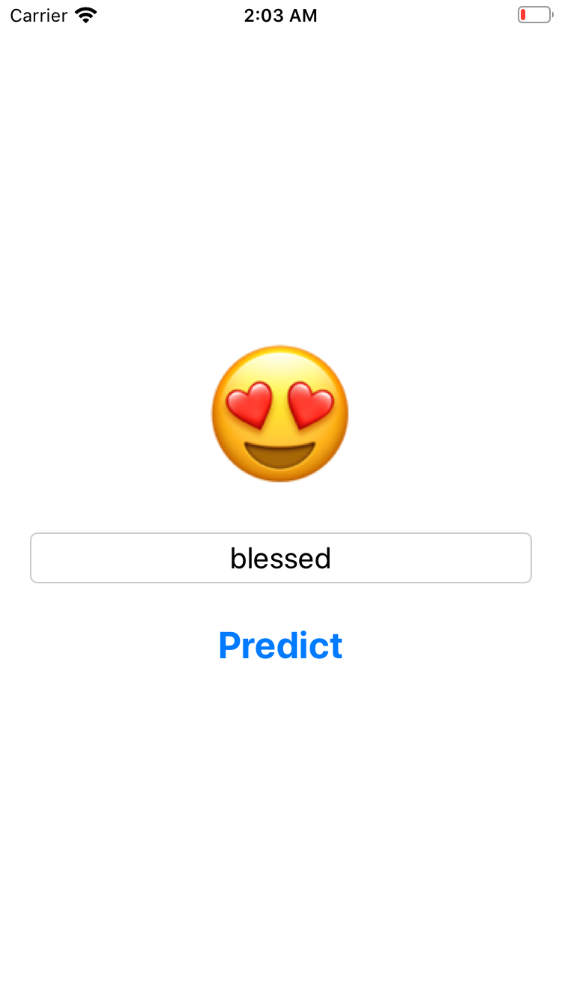

#  Twittermenti
An iOS Application to analyse sentiment of tweets.

This application fetches latest tweets regarding the provided search string as a Hashtag or Username, then analyses sentiment of tweets and displays the overall sentiment.

## Screenshots

## Technologies
- Swift Programming Language
- Storyboard
- UIKit - UIViewController | UILabel | UITextField | UITextFieldDelegate | UIButton
- Cocoa - URL
- CreateML - MLTextClassifier | MLModelMetadata
- SwifteriOS

## Build It Yourself
- <a href=""> Download Training Data </a>
- Create TweetSentimentClassifier MLModel

            import Cocoa
            import CreateML

            let trainingData = try MLDataTable(contentsOf: URL(fileURLWithPath: "<full_path_to_training_data>"))
            let sentimentClassifier = try MLTextClassifier(trainingData: trainingData, textColumn: "text", labelColumn: "class")
            let metadata = MLModelMetadata(author: "<username>", shortDescription: "A model trained to classify sentiment of tweets", version: "1.0")
            try sentimentClassifier.write(toFile: "<path_to_save_mlmodel>")

- Move MLModel to project's root directory and add reference (drag and drop MLModel to project).
- <a href=""> Download Swifter Project </a>. Add to project using 'drag & drop' or 'Add files to "Twittermenti"...'.
- Add SwifteriOS Framework in project.
- Sign up as a <a href="https://developer.twitter.com/en/portal/dashboard"> Twitter Developer </a> account if you haven't already.
- Create an app on Twitter Developer Portal and get API Key & Secret.
- Remove reference of PrivateData.swift (simply delete the file).
- Create a new Swift file including structure named "PrivateData" with static constants for API Key & Secret.

        struct PrivateData {
            static let apiKey: String = "api_key"
            static let apkiKeySecret: String = "api_key_secret"
        }
        
- Use Swifter|Apple Documentation for further assistance.
